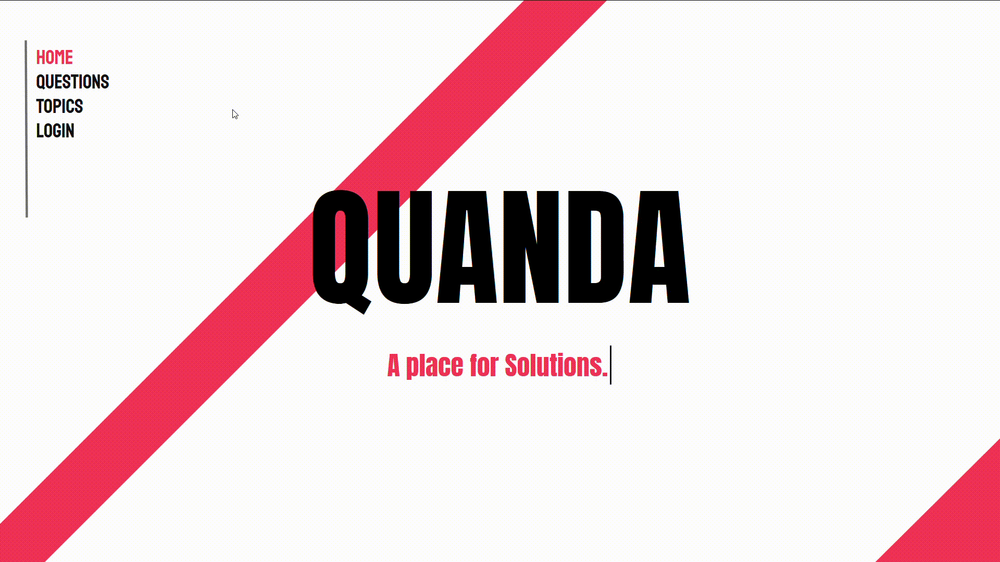
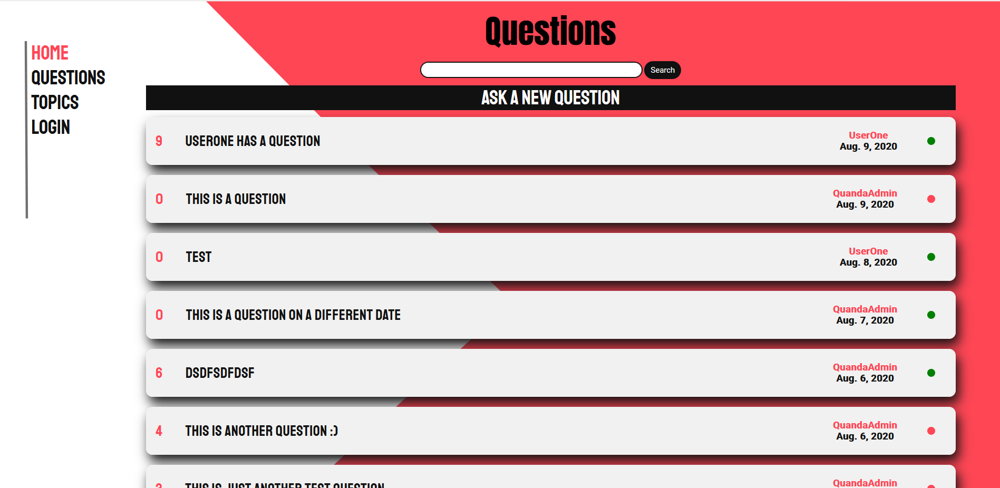
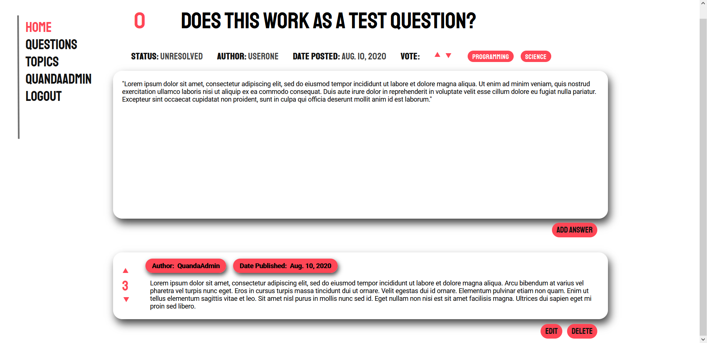
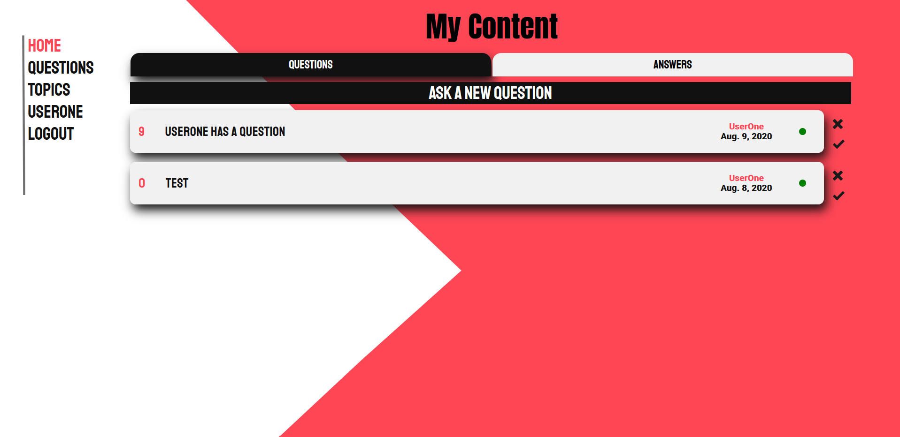
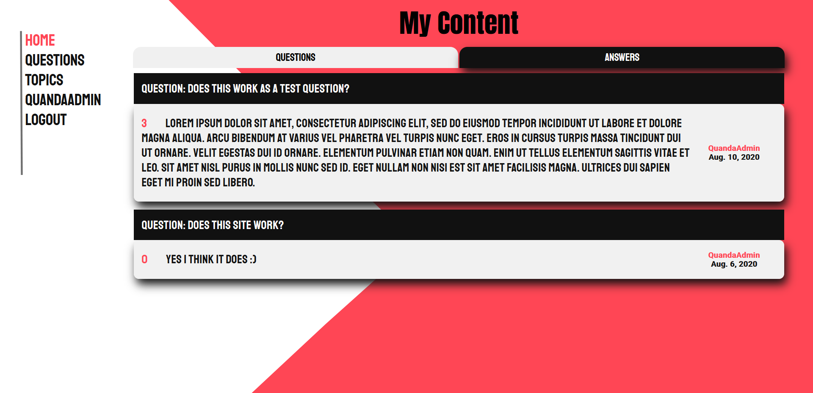
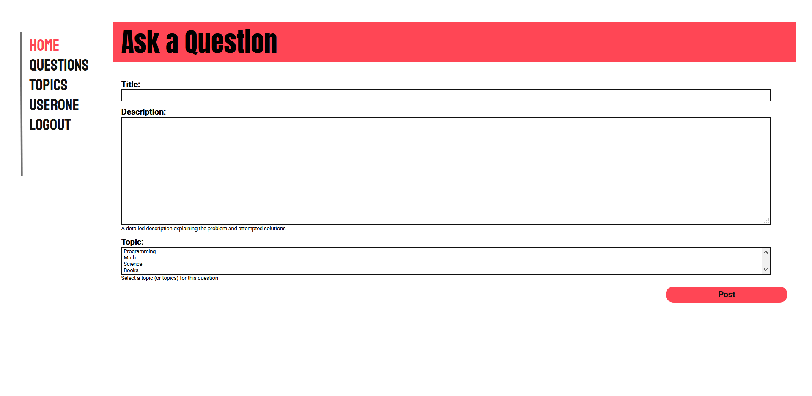

# Quanda: A Q & A Website
Quanda was a simple questions and answers website, created using the [Django](https://www.djangoproject.com/) web framework, and built with the goal of developing a basic understanding of server-side web programming and generating dynamic web content.
The project helped me familiarize myself with the MVT (Model View Template) architectural pattern, used by Django, and further reading allowed me to obtain a better understanding of the basics of web security.

The site itself, allows logged in users to post questions and answers as well as vote (up or down) other responses. Logged in users are also free to make changes (edit, delete, mark as resolved, etc.) to the content that they have created or navigate to the “My Content” page to view all of the content they have posted.  

## Notes
Email services not configured. Reset password link is printed to the console.

## Screenshots

My Content Questions                                  |  My Content Answers
:----------------------------------------------------:|:---------------------------------------------------:
 |  

## Author 
Shivam Sood 